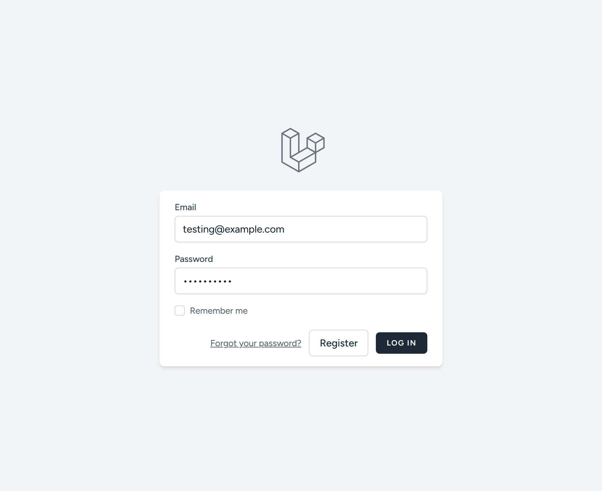

  <h1>Framework Based Programming - EF234501 (2025)</h1>

  <b>Institut Teknologi Sepuluh Nopember</b> 
  Sepuluh Nopember Institute of Technology

  

This project is a task management website application developed using Laravel as part of the Midterm Mini Project for the Framework Based Programming class. This web application is created by <a href="https://github.com/aleahfaa">Iffa Amalia Sabrina</a>.

On behalf of:

**Agus Budi Raharjo, S.Kom., M.Kom., Ph.D.**

---

## Video
**YouTube Submission Link**: https://youtu.be/t650TgXywQU?si=uKayczaRhZ5I125k

## Database Schema
### 1. `users` Table
| Column | Data Type | Description |
| :------ | :-------- | :----------- |
| **id** | `INTEGER` | Primary Key |
| **name** | `VARCHAR` |  |
| **email** | `VARCHAR` |  |
| **email_verified** | `DATETIME` |  |
| **password** | `VARCHAR` |  |
| **remember_token** | `VARCHAR` |  |
| **created_at** | `DATETIME` |  |
| **updated_at** | `DATETIME` |  |
### 2. `categories` Table
| Column | Data Type | Description |
| :------ | :-------- | :----------- |
| **id** | `INTEGER` | Primary Key |
| **user_id** | `INTEGER` | Foreign Key → `users.id` |
| **name** | `VARCHAR` |  |
| **color** | `VARCHAR` |  |
| **created_at** | `DATETIME` |  |
| **updated_at** | `DATETIME` |  |
### 3. `tasks` Table
| Column | Data Type | Description |
| :------ | :-------- | :----------- |
| **id** | `INTEGER` | Primary Key |
| **user_id** | `INTEGER` | Foreign Key → `users.id` |
| **category_id** | `INTEGER` | Foreign Key → `categories.id` |
| **name** | `VARCHAR` |  |
| **details** | `TEXT` |  |
| **subtasks** | `TEXT` | |
| **deadline** | `DATE` |  |
| **is_completed** | `TINYINT` | Completion status (`1` = completed, `0` = pending) |
| **created_at** | `DATETIME` |  |
| **updated_at** | `DATETIME` |  |

## Features
- Task management (CRUD) with deadline, task detail, category, sub-tasks
- Category management (CRUD) with color highlight
- Form to edit and created task
- Form to edit and created category

## Screenshots
  
  
  
  
  
  
  
  
